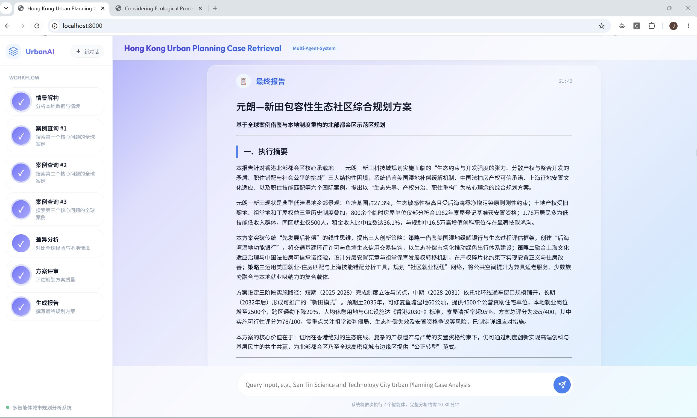

## 项目简介

### **CGAP** 是一个面向城市规划案例迁移的结构化推理系统。

该系统尝试解决：

> “国际成功经验如何在不同城市背景下进行可迁移性分析与本地化适配”

这一问题。

与传统 RAG 或普通 Agent Workflow 不同，CGAP 将规划案例学习拆解为：

- Context Modeling（情景建模） 
- Case Retrieval（案例检索）   
- Gap Analysis（差异对比）
    
三个显式推理阶段。

系统通过中间状态（Intermediate Representations）组织信息流，而非直接依赖单次上下文推理，从而提高复杂规划任务中的证据整合能力与上下文稳定性。

### Research Motivation

当前大多数 RAG 或 Agent 系统将检索结果直接拼接到上下文窗口中，要求模型隐式完成信息筛选、冲突消解与约束推理。

在复杂城市规划任务中，这种方式容易导致：

- 上下文噪声累积
- 注意力稀释
- 证据利用不稳定
- 推理过程缺乏可控性

CGAP 尝试通过 Structured Intermediate States 与 Multi-Stage Reasoning Workflow 显式组织信息流，使复杂规划任务从隐式上下文推理转变为显式结构化推理过程。

  

## CGAP Workflow（推理流程）

---

 

   

---

> CGAP 将复杂规划推理拆解为多个结构化阶段, 通过显式信息组织减少上下文噪声与隐式推理负担。
    

## Demo

---

---
 

## 项目结构

系统由五个层次构成：**Orchestration Layer**、**Core Reasoning Stages**、**Infrastructure Services / Reasoning Utilities**、**Evaluation Framework**、**Knowledge & Runtime Layer**。

### Structured Intermediate States

CGAP 的核心设计并非依赖单次长上下文推理，而是通过显式中间状态逐步组织信息。每个推理阶段都会生成结构化状态对象，并仅向后续阶段传递任务相关的信息子集。这种设计将部分推理负担从模型内部隐式注意力机制转移到外部工作流结构，从而提高复杂任务中的信息组织能力与证据可控性。

这种设计使系统能够：

- 显式管理推理过程
- 控制信息传播路径
- 降低长上下文注意力稀释
- 提高复杂任务中的证据利用率

  

### Orchestration Layer

系统提供两种编排范式，共享同一套推理基础设施：

- **Workflow 模式**（`main.py` + `workflow.py`）：固定推理流水线，各阶段按预定义顺序执行，支持并行分支和条件路由。系统的主要运行模式。
- **Plan-Execute 模式**（`main_pe.py` + `plan_execute/`）：LLM 先生成任务计划，再由子阶段逐步执行，适合需要灵活任务分解的场景。
- **全局状态**（`state.py`）：`AgentState` 作为唯一状态对象贯穿整个推理过程，通过 Reducer 机制处理并行分支的状态合并。
- **断点恢复**（`checkpoint.py`）：每个阶段完成后自动持久化状态，支持从任意已完成步骤恢复运行。

  

### Core Reasoning Stages

CGAP 将城市规划案例迁移拆解为多个显式推理阶段，通过中间状态逐步组织上下文信息，而非依赖单次长上下文生成。

 
    
| 阶段 | 作用 | 核心输出 |
|------|------|----------|
| **Context Modeling** | 将规划问题转换为结构化约束表示 | Context State |
| **Case Retrieval** | 检索具有结构相似性的全球案例 | Retrieved Cases |
| **Gap Analysis** | 分析案例前提条件与本地环境差异 | Adaptation Strategies |
| **Evaluation & Feedback** | 评估结果质量并触发迭代修正 | Refined State |
| **Report Generation** | 生成结构化规划报告 | Final Report |

  

**主要功能**：
- Context Modeling ： 加载本地数据，模糊匹配查询区域，执行统计分析与可视化，搜索公众意见，提取核心规划问题并改写为国际检索词。
- Case Retrieval： 多源并行搜索（网页 + 学术文献），BM25 + Sentence-BERT 混合检索排序，LLM 筛选最佳案例，Gap-Driven 深度研究自动补全案例的结构化信息。
- Gap Analysis： 逐问题对比全球案例与本地约束条件，结合本地规划法规生成本地化改造方案。
- Evaluation： 四维评分（问题匹配 / 信息完整 / 逻辑连贯 / 实施可行），未通过时自动分析反馈、生成新检索方向，触发重新检索（最多 3 轮迭代）。
- Report Generation： 整合所有案例分析与适配方案，生成结构化规划报告，附详细案例附录。

  

### Infrastructure Services

为推理阶段提供统一的外部服务抽象：

- **LLM Service**（`services/llm_service.py`）：异步调用，内置重试与超时控制，支持多供应商切换。
- **Search Service**（`services/search_service.py`）：网页搜索与学术文献检索（Semantic Scholar / Google Scholar / ArXiv），指数退避与速率限制。
- **Fetch Service**（`services/fetch_service.py` + `tools/web_fetcher.py`）：网页内容抓取与 PDF 文本提取。

  

### Reasoning Utilities

支撑推理过程的核心算法与工具：

- **Hybrid Retrieval**（`tools/retrieval.py` + `tools/HybridRetriever.py`）：BM25 关键词匹配 + Sentence-BERT 语义相似度，通过 Reciprocal Rank Fusion 融合排序，支持中英文分词。
- **Deep Research**（`tools/deep_research.py`）：Gap-Driven Tree Search 算法，自动提取案例的 7 个结构化字段（城市 / 时间 / 问题 / 方案 / 成效 / 前提 / 局限），迭代搜索补全缺失信息。
- **Data Analysis**（`tools/data_loader.py` + `tools/data_analysis.py`）：数据加载与统计分析，聚类分析、PCA 降维、地图可视化。
- **Prompt Management**（`prompts/`）：所有 Prompt 模板从代码中解耦为独立文本文件，支持变量注入，按推理阶段和工具分目录组织。

  

### Evaluation Framework

系统可信度的核心来源。大多数 Agent 项目只有 demo，CGAP 提供了完整的实验与评估体系：

- **Ablation Framework**（`experiments/`）：通过 Feature Flags 控制各组件开关（本地分析 / 网页搜索 / 混合检索 / LLM 筛选 / 深度研究 / 差异分析），支持批量运行和结果收集。
- **Automated Evaluation**（`eval/`）：LLM-as-a-Judge 机制，对比 Workflow 输出与单 LLM 基线，支持成对比较和多维度评分，评估结果按消融维度分目录存储。

  

### Knowledge & Runtime Layer

- **Knowledge Base**（`data/`）：香港区域数据表、规划情景知识库、规划法规知识库和 GeoJSON 地图文件，作为本地知识源。
- **Runtime Output**（`output/`）：运行时生成，包含断点快照、规划报告、案例摘要和综合分析报告。
- **Model Cache**（`models/`）：本地缓存的 Sentence-BERT 嵌入模型，用于混合检索的语义编码。

